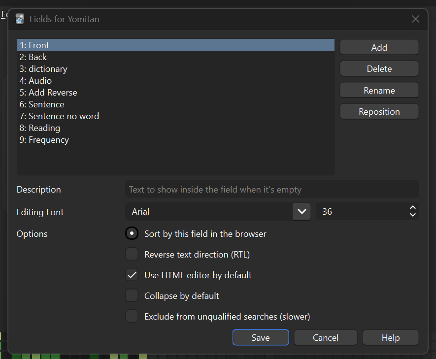
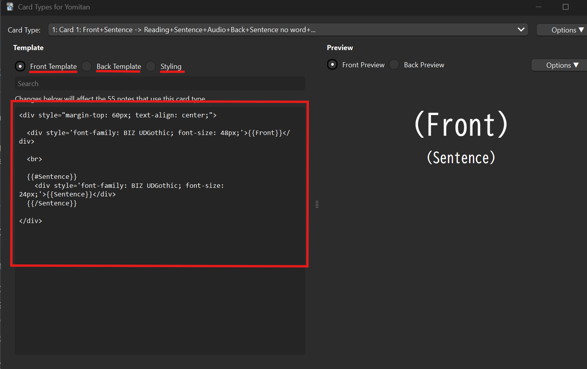
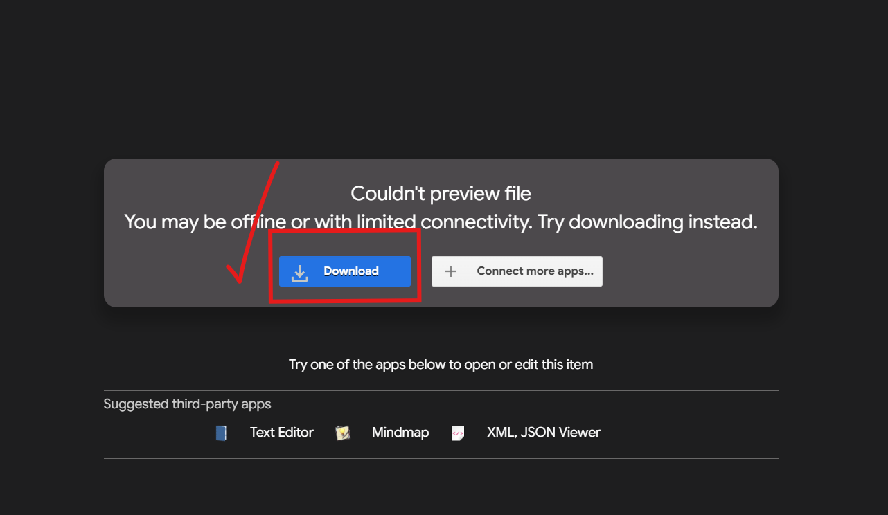
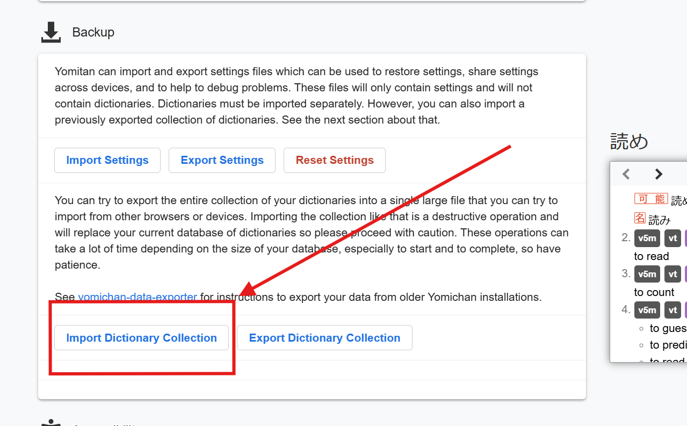
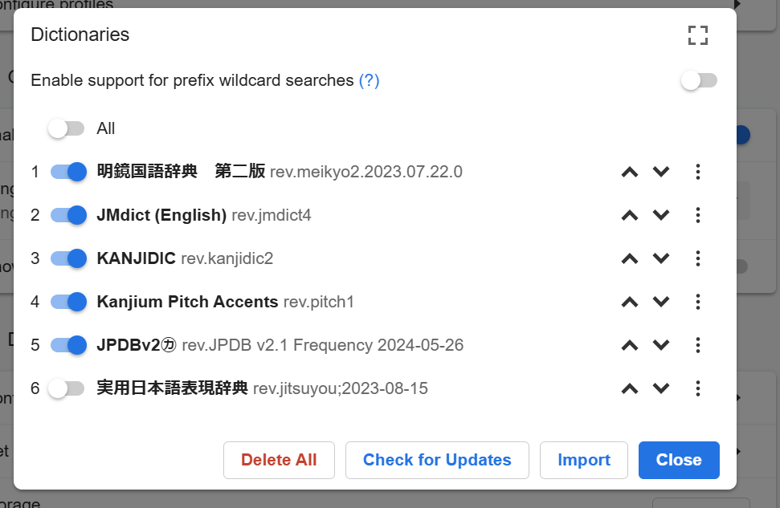
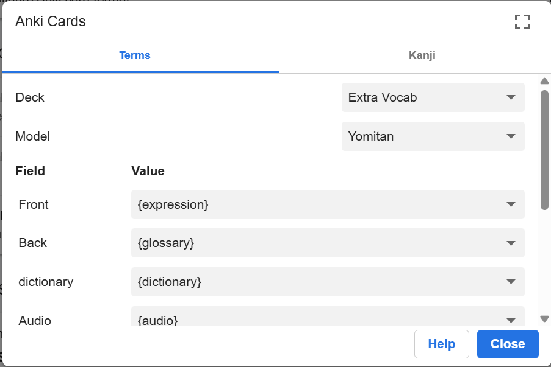
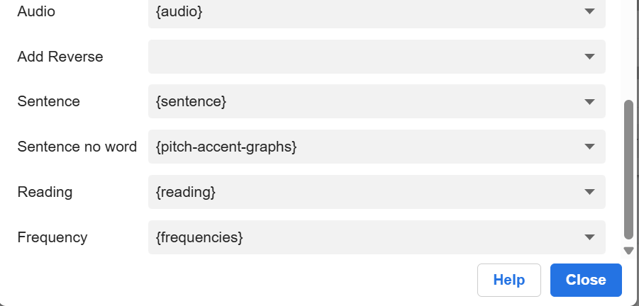
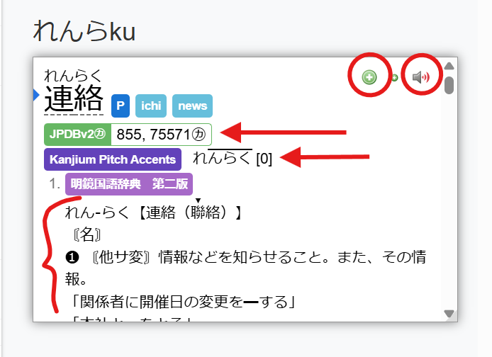
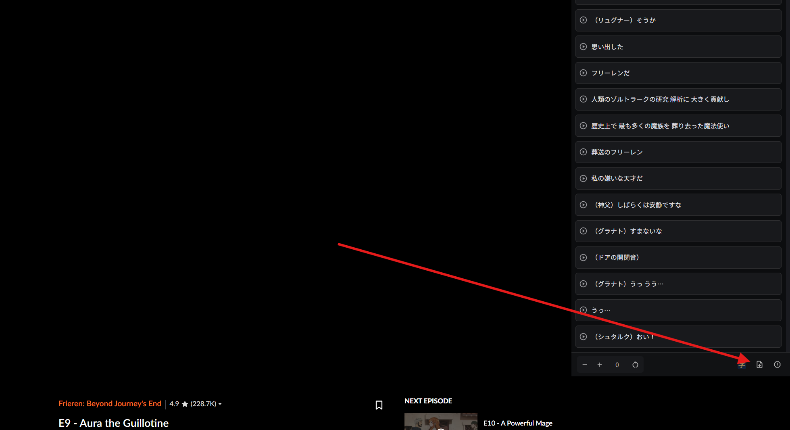

# Anki + AnkiConnect + Yomitan Setup Guide  
_For Japanese Study – Step-by-Step_

---

## Introduction

This guide will walk you through setting up a powerful Japanese study workflow using **Anki**, **AnkiConnect**, **Yomitan**, and subtitle mining tools like **ManabiDojo**.

With this setup, you'll gain access to a robust inline dictionary that can:

- List word definitions  
- Show pitch accent information  
- Play native speaker audio  
- Display word frequency  
- Break down kanji meanings and stroke order  

You'll also be able to generate detailed flashcards with a single button press. These cards will include all the above information and be sent directly to your Anki deck.

Additionally, you'll be able to watch anime on Crunchyroll with native Japanese subtitles, making it easy to start your word mining journey.


*Some steps get a little technical, so pay close attention and hang in there. Skimming past steps might result in confusion later on*

---

## Step 1: Prepare Anki

### 1.1 Install AnkiConnect
- Open Anki.
- Go to **Tools → Add-ons → Get Add-ons…**
- Paste this code: **2055492159** and click **OK**.
- Restart Anki.

### 1.2 Create Your Yomitan Note Type
- Go to **Tools → Manage Note Types**.
- Click **Add → Add: Basic** and name it **Yomitan**.
- Select your note type and click **Fields**.
- Add these fields _exactly_ as listed below:


>   
> **Example**: Your Anki fields should look similar to this screenshot.

### 1.3 Configure Card HTML Templates and CSS
**Tools → Manage Note Types** and click on your new **Yomitan card type → Cards**

You'll have to navigate between the Front, Back, and Styling tabs.
>   
> **Example**: Your screen should look like this.
> 
Copy the following templates into the respective Anki cards setup, making sure to delete whatever prexisting code is there:

### **Front Template:**
```html
<div style="margin-top: 60px; text-align: center;">
  <div style='font-family: BIZ UDGothic; font-size: 48px;'>{{Front}}</div>
  <br>
  {{#Sentence}}
    <div style='font-family: BIZ UDGothic; font-size: 24px;'>{{Sentence}}</div>
  {{/Sentence}}
</div>

```
### **Back Template:** 

```html
<div style="margin-top: 60px; text-align: center;">
  <!-- Reading -->
  <div style='font-family: BIZ UDGothic; font-size: 48px;'>{{Reading}}</div>
  {{#Sentence}}
    <div style='font-family: BIZ UDGothic; font-size: 24px; margin-top: 10px;'>{{Sentence}}</div>
  {{/Sentence}}
  {{#Audio}}
    <div style='margin-top: 20px;'>{{Audio}}</div>
  {{/Audio}}
  <hr id="answer">
  <!-- Glossary Output -->
  {{#Back}}
    <div style='font-family: BIZ UDGothic; font-size: 20px; text-align: left; white-space: pre-wrap;'>{{Back}}</div>
  {{/Back}}
  <!-- Cloze-style sentence -->
  {{#Sentence no word}}
    <div style='font-family: BIZ UDGothic; font-size: 20px; margin-top: 20px;'>{{Sentence no word}}</div>
  {{/Sentence no word}}
  <!-- Frequency -->
  {{#Frequency}}
    <div style='font-family: BIZ UDGothic; font-size: 18px; margin-top: 10px;'>{{Frequency}}</div>
  {{/Frequency}}
</div>

```
### **CSS Template: (Styling)** 

```css
.card {
  font-family: 'BIZ UDGothic', sans-serif;
  font-size: 20px;
  text-align: center;
  color: black;
  background-color: white;
}
hr#answer {
  margin: 30px auto;
  width: 50%;
  border: 1px solid #ccc;
}
```
**Be sure to save your changes!**
### 1.4 Upload to web
- Close the card editing pages, but leave the main Anki page open.
- You will need to sync your changes after this.
- If prompted, be sure to hit **Upload to Anki Web**
- If not propmted, hit Sync, then **Upload to Anki Web**
- **IMPORTANT NOTICE:** If you are using other devices, be sure you **DOWNLOAD** from the web on those devices. If you upload from your other devices, it will overwrite your work here.

### 1.5 Create Empty Deck 
- You'll want to create a new deck that new flashcards can get sent to.
- From the main screen of Anki (click **decks** if you're lost), there's a **Create Deck** on the bottom of the page.
- Name your new deck whatever you feel like, just be sure to remember it for later. I named mine "Extra Vocab."
  
## Step 2: Set Up Yomitan (Chrome Extension)

### 2.1 Install Yomitan

- Install the extension from the [Yomitan Chrome Web Store](https://microsoftedge.microsoft.com/addons/detail/yomitan-popup-dictionary/idelnfbbmikgfiejhgmddlbkfgiifnnn).
- You'll get sent to the Yomitan Welcome Page.
- Here, you'll want to allow the permissions Yomitan wants
- Find the switch near the bottom saying something like "Open Yomitan Welcome Page on Startup" -> Unselect that.
- You can then close the welcome page

### 2.2 Import Dictionaries

- Download the [Yomitan Dictionaries Bundle](https://drive.google.com/file/d/1ExmPI7cDwWpsCO6g8YBslAAdF92BwJqx/view?usp=sharing).

*Example: The link should take you here, it can't load or open the json file, so just download it and move on.*

### Navigate to the Yomitan Settings Page
- Click the Yomitan icon in Chrome (it might be hiding in the extensions puzzle piece in the top right of the browser) and go to **Settings (represented as a cog)**
- From the settings page, navigate to **Backup** (on the leftside of the settings page). 
- Import the file using Yomitan’s import feature.
- THIS IS IN THE **BACKUP**, **NOt THE DICTIONARY SECTION**
  
*Example: Importing dictionaries into Yomitan using the backup.*
- It should be the most recent file in your downloads folder, select it and hit open.
- It will take a moment to download all the dictionaries. It's over 800,000 lines of dictionary data.
- You can watch the progress under where you just imported it, begin the next steps once it's finished. 
  
- Now **Enable Dictionaries** at the top of the page. Click the **Configure Installed and Enabled Dictionaries**
- Your dictionaries might not be in the same order 
  
*Example: Enabling/disabling dictionaries in Yomitan.*

- *(If you don’t want native Japanese definitions, uncheck the one in Japanese".)*
- There's a demo on the right side to display how your Yomitan pop-up dictionary will look on the right side of the screen. You can mess around with stuff until it's how you like.


### 2.3 Configure Anki Integration

- Navigate to the **Anki** tab (Still in Yomitan).
- Ensure **Anki is open** and AnkiConnect (seen from yomitan) is connected.
- Note: You may need to switch **Enable Anki Integration** from Yomitan's Anki tab to **on**.
- Click into the **Configure Anki card format**
- Configure the Deck to the one you made earlier, this is where the cards will get sent.
- Configure the Model Type to the Yomitan card type you created earlier.
- Now fill in the field values in the following way

| Anki Field          | Yomitan Value             |
|---------------------|---------------------------|
| Front               | `{expression}`            |
| Back                | `{glossary}`              |
| dictionary          | `{dictionary}`            |
| Audio               | `{audio}`                 |
| Add Reverse         |                           |
| Sentence            | `{sentence}`              |
| Sentence no word    | `{pitch-accent-graphs}`   |
| Reading             | `{reading}`               |
| Frequency           | `{frequencies}`           |

  

  
*Example: Yomitan field mapping.*

---
  
*Example: This is what the example popup on the right should look like now. Notice the **Add Flashcard** and **Audio** buttons, as well as the listed **Frequency**, 
  **Pitch Accent Chart**, and **Definition**.*
  
- From this popup (activated by holding shift over any Japanese in your chrome browser) you can add the flashcards to you anki with a single button press of the green "+" seen in the top right of the popup.
- You'll also be able to get detailed kanji information by clicking on a kanji that appears in the words
- 
### 2.4 _Optional_ Personalization
- Feel free to look around some of the other options in the Yomitan settings before you're done with it. There's some useful stuff like the **Position and Size** tab I would reccomend. Kanji can get small, and increasing the size in the settings is the only way to make it bigger. I blew mine up to 175% on my laptop, and 150% on my desktop so I'd never have to strain again. 

---
## Step 3: Set Up ManabiDojo (Crunchyroll Subtitle Miner)

### 3.1 Install ManabiDojo 
- Install **ManabiDojo** from the [Chrome Web Store](https://chromewebstore.google.com/detail/manabidojo-learn-japanese/efbhkecfjhcpmepgbpogiiaidkmjhojl).
- Once installed, subtitles can be clicked directly within Crunchyroll videos to create Anki cards automatically.
- For many popular anime, you shouldn't have to do _anything_, and you're **ready to go**!

### 3.2 Potential Manual Subtitle Insertion
- However, if Crunchyroll does not have Japanese subtitles for a particular anime, (you open the anime you want to watch, and no subtitles pop up) you can download raw subtitle files from [kitsunekko.net](https://kitsunekko.net/dirlist.php?dir=subtitles%2Fjapanese%2F) and upload them into the extension.
- Upload these manually into the ManabiDojo interface (bottom right of your Crunchyroll video).

*Example: Uploading raw subtitles into ManabiDojo.*

### 3.3 Optional Settings configuration
- By default, Manabi Dojo has english subtitles on. This defeats the purpose of what we're going for, **Click the Cog in the Top Right**
- Under **Nativer subs mode**: Select either **Pause** (English is hidden until you pause) or **Hidden** (No English ever).
- Also consider increasing the size of the Japanese subs with the **Japanese Subs Size** option to make complex kanji more readable.
- There are other settings you can mess around with, feel free to do whatever. 
---

## Final Tips

- Yomitan _only activates_ while holding down **Shift**. This is so it's not randomly getting in your way during normal computer activity. 
- Ensure **Anki is open** when sending cards from Yomitan or ManabiDojo. If anki is closed, it cannot connect to it. 
- If you encounter issues, verify AnkiConnect is active and not blocked by antivirus or firewall.
- Confirm all field names and mappings exactly match those in Anki.
- For troubleshooting, search your specific issue online or consult Japanese-learning community forums. Updates to any 3 pieces of software (Anki, Yomitan, Anki connect) may cause issues, so I personally ignore new updates. If suddenly it stops working, then I'll go in and update everything. 


